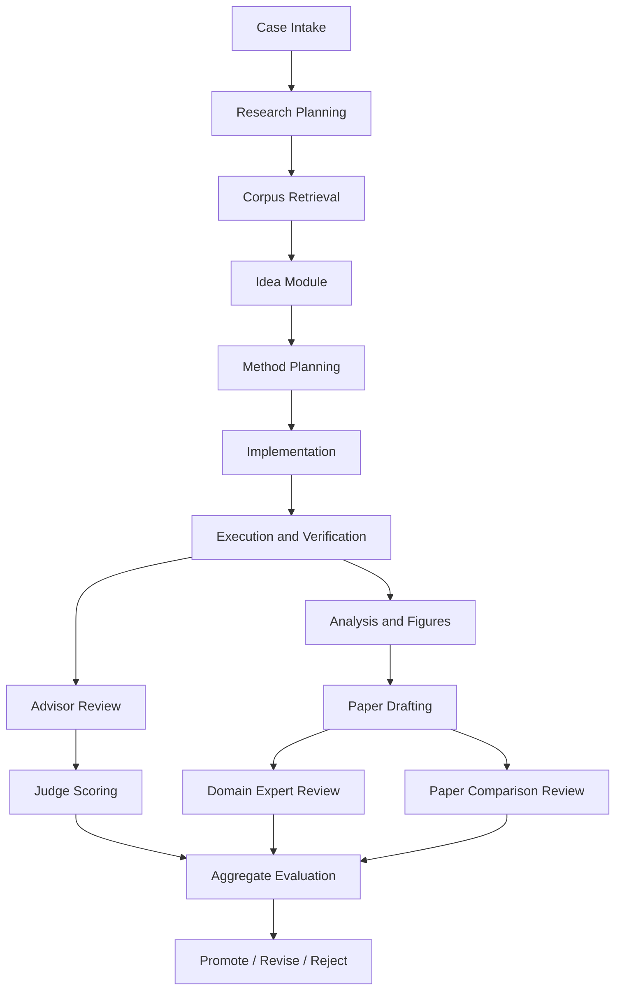

# SciCLI 多智能体 Scientist-Bench 重构执行计划

## 1. 目标定义

本次重构的目标不是把当前单智能体代码助手简单扩展成“会开几个子任务”的系统，而是把 SciCLI 升级为一个面向 AI4Science 的多智能体研究工作台，核心支持两条主线：

1. 直接生成一篇结构完整、图表清晰、可审稿的论文草稿。
2. 复现目标论文，并在 Scientist Bench 设定下做结构化评估。

系统需要同时支持：

- `paper generation`：输入参考文献集 `R`、核心思想 `I`、数据集 `D`，生成论文草稿 `p`。
- `paper reproduction`：给定目标论文 `y`，在 Level 1 和 Level 2 下复现其方法。
- `review and scoring`：对生成物和复现结果做多智能体评审与聚合评分。
- `artifact execution`：能运行代码、执行计算、生成图表、导出 LaTeX 论文。

## 2. 顶层设计原则

### 2.1 总体范式

架构采用两层组合：

- `AG2-style natural collaboration`：上层是自然式群聊协作，表现为一群研究员、审稿人、工程师围绕同一 case 交流。
- `LangGraph-style DAG orchestration`：下层是显式有向图编排，保证任务依赖、状态流转、失败恢复、预算控制可追踪。

这两层必须同时成立：

- AG2 负责“像团队一样工作”。
- LangGraph 负责“像系统一样可控”。

### 2.2 设计约束

- 保留现有 `session + taskrun + research` 的可观测性和持久化能力，不推翻底座。
- 新增一层明确的 `orchestrator / benchmark / agent-role / artifact` 域模型。
- 所有评估必须结构化落盘，不能只停留在对话文本中。
- 工具加载必须按需化，避免把全部 MCP、skills、Docker 工具一次性塞进上下文。
- 论文生成链路必须原生支持图表、实验日志、代码快照、LaTeX 产物。

## 3. 本次重构要纳入的创新点

### 3.1 预装 AI4S 工具生态

系统默认预装并统一编目以下能力：

- 经典 AI4S MCP 库，优先支持 `arxiv`、文献检索、数据检索、知识库类 MCP。
- `claude-scientific-skills`。
- `HPC-Skills`。
- 图表与可视化相关 skills。
- 论文排版相关能力，优先支持 `LaTeX` 工作流。
- 经典科研软件的 Docker 运行能力，首批优先 `OpenFOAM`，后续可扩展到更多 CAE/HPC 软件。

这里的关键不是“装很多”，而是：

- 统一注册。
- 能按需发现。
- 能基于任务上下文进行动态挂载。

### 3.2 强化 Research Agent

Research Agent 不是普通搜索代理，而是整套系统的高价值中枢，设计上参考 `OpenAI deep research` 的几个关键能力：

- 先生成研究计划，再执行。
- 可追踪研究进度。
- 明确来源边界，允许受限站点/可信站点搜索。
- 输出带引用的结构化报告。
- 支持中途中断、重规划和补充资料。

结合现有 SciCLI，Research Agent 将成为：

- 文献入口。
- 证据汇总器。
- 问题澄清器。
- 复现协议拆解器。
- 审稿对比报告的证据供应者。

### 3.3 Idea Module

新增独立 Idea 模块，不允许任何核心实验方案直接跳过该模块。

模块由两个对抗角色组成：

- `Idea Maker Agent`：提出、细化、组合和扩展 idea。
- `Idea Hater Agent`：批判、否决、指出概念错位、常识性重复、无法验证性和实验漏洞。

只有通过该模块的 idea 才能进入主实验图。

### 3.4 Tool Search 创新

当前工具检索如果只停留在 `Regex + BM25`，在工具、MCP、skills、Docker runtime 增长后会明显失效。需要升级为按需加载的多阶段检索：

- `Stage A`：轻量索引过滤。
- `Stage B`：语义路由与能力匹配。
- `Stage C`：工具描述动态压缩与重写。
- `Stage D`：执行后反向更新工具先验。

目标不是只找到“名字最像”的工具，而是找到“当前阶段最该暴露给当前 agent 的最小工具子集”。

### 3.5 无训练、基于文本的逐步优化

参考 ACL Anthology `2025.findings-acl.1149` 论文提出的思路，本系统采纳：

- 不先做模型微调。
- 优先做 prompt、agent 指令、tool description、tool routing 的联合文本优化。
- 通过逐步优化降低工具使用开销，提高有效调用率和响应效率。

这意味着系统演化路线优先是：

- 优化上下文。
- 优化工具描述。
- 优化角色提示词。
- 优化调度图。

而不是一开始就转向训练和复杂 RL。

## 4. 目标产品形态

### 4.1 用户输入

用户面向系统输入一个 benchmark case：

- `R`：15-20 篇参考文献集。
- `I`：核心思想。
- `D`：数据集。
- `y`：目标人类论文，总数 22 篇中的某一篇。
- `mode`：`paper-generation`、`reproduction`、或 `joint`.

### 4.2 系统输出

系统最终产出：

- 可读论文草稿。
- 可运行代码。
- 实验结果与图表。
- LaTeX 项目或 PDF。
- 复现报告。
- domain expert review。
- advisor analysis report。
- judge score。
- ICLR-style 对比评审报告。
- 全链路 artifact。

## 5. 多智能体角色设计

### 5.1 核心角色

- `Chief Scientist / Orchestrator`
  - 负责全局目标分解、预算分配、阶段切换、冲突仲裁。
- `Research Agent`
  - 负责 deep-research 风格的检索、文献对齐、证据摘要、方法拆解。
- `Idea Maker Agent`
  - 负责提出 candidate ideas。
- `Idea Hater Agent`
  - 负责 idea 批判、过滤与拒绝。
- `Method Planner Agent`
  - 负责将想法转成可执行 pipeline。
- `Code Agent`
  - 负责实现训练、实验、分析代码。
- `Execution Agent`
  - 负责运行 Docker / shell / HPC / workflow。
- `Figure Agent`
  - 负责图表设计、统计可视化、图注与版式统一。
- `Paper Writer Agent`
  - 负责论文骨架、段落组织、实验叙述、结果解释。
- `Domain Expert Reviewer`
  - 负责论文质量评分和 review-like feedback。
- `Advisor Agent`
  - 负责复现正确性分析报告。
- `Judge Agent`
  - 负责对 Advisor 报告做 5 分制独立评分。
- `Paper Comparison Reviewer`
  - 参照 ICLR 指南比较 `p` 与 `y`。

### 5.2 群聊协作方式

上层采用“研究员群聊”语义：

- 每个 agent 都有独立 persona 和职责边界。
- 每轮群聊消息不等于立即执行；是否触发工具由 LangGraph 节点决定。
- 群聊内容全部结构化归档为 `claims / evidence / objections / decisions`。

这样做的原因：

- 保留 AG2 的自然讨论感。
- 避免纯文本群聊失控。
- 让每次争论都能回放、复审和纳入最终论文或评审材料。

## 6. LangGraph 风格执行图

建议的一级 DAG：



### 6.1 分层图结构

- `Graph 0: Session Graph`
  - 管理 benchmark suite、case、预算、全局缓存。
- `Graph 1: Case Graph`
  - 管理单个论文生成/复现实例。
- `Graph 2: Role Subgraph`
  - 管理某个角色内部的 plan -> act -> review 循环。

### 6.2 图上关键控制信号

- `case_resolved`
- `case_not_resolved`
- `revise_needed`
- `missing_evidence`
- `code_not_executable`
- `paper_not_readable`
- `novelty_not_supported`
- `insufficient_reproduction_confidence`

## 7. Scientist Bench 任务模型

### 7.1 Case 模型

每个 case 至少包含：

- `case_id`
- `benchmark_level`
- `reference_set`
- `core_idea`
- `dataset`
- `target_paper_y`
- `masked_method_spec`
- `budget`
- `active_graph_state`
- `artifacts`
- `scores`
- `review_records`

### 7.2 两个 level

- `Level 1`
  - 保留目标论文 pipeline，遮蔽具体技术细节，要求复现。
- `Level 2`
  - 不显式提供目标方法，要求系统从文献、pipeline、结果目标中反推实现。

### 7.3 两类核心目标

- `Goal A: 生成论文`
- `Goal B: 复现论文`

系统应支持同一 case 下两条主线共享：

- 文献证据。
- 代码实现。
- 结果图表。
- reviewer 反馈。

## 8. 评估体系

### 8.1 Paper Generation 评估

采用专家审稿式评估：

- `domain expert numerical score`
- `review-like feedback`

并计算整体成功率，至少包含：

- 是否生成可读论文。
- 是否包含 novel insight。
- 代码是否跑通。

同时做多维度打分：

- `idea quality`
- `method soundness`
- `result interpretation`
- `writing quality`

### 8.2 Reproduction 评估

#### Completeness

衡量是否在预算内生成可执行代码。

终止协议必须显式：

- `case_resolved`
- `case_not_resolved`

#### Correctness

针对隐藏实现缺陷、概念错位和组件缺失，采用双层评判：

1. `Advisor Agent` 生成详细分析报告。
2. `Judge Agent` 基于报告给出 `1-5` 分。
3. 多次独立判分求平均，作为 correctness。

### 8.3 Paper-vs-Y 对比评审

专门的 `Paper Comparison Reviewer` 遵循 ICLR 风格，对 `p` 与 `y` 做比较分析，覆盖：

- `research motivation`
- `methodology`
- `novelty`
- `experimental validation`

## 9. Research Agent 详细设计

### 9.1 设计定位

Research Agent 不是一个普通 web search node，而是 case graph 的“证据操作系统”。

### 9.2 参考 deep research 的关键能力

结合 OpenAI 于 `2025-02-02` 发布的 `deep research` 官方说明，本系统应借鉴以下机制：

- 执行前提出 research plan。
- 运行中展示进度并允许重定向。
- 支持 web、上传文件、连接数据源。
- 结果必须可验证，保留 citations/source links。

### 9.3 本项目中的落地能力

Research Agent 需要支持：

- 多源文献检索。
- PDF 解析与章节定位。
- R 集合内部的 citation graph 构建。
- 目标论文 `y` 的 pipeline 抽象。
- 方法缺口定位。
- 对 Code Agent / Writer Agent 输出结构化 evidence pack。

### 9.4 输出格式

Research Agent 的产物不能只是一段长文本，至少包括：

- `question decomposition`
- `source inventory`
- `evidence table`
- `method hypotheses`
- `reproduction risks`
- `citation bundle`

## 10. Idea Module 详细设计

### 10.1 输入

- `R`
- `I`
- `D`
- 当前 case 的研究问题
- 已知约束

### 10.2 输出

- `accepted ideas`
- `rejected ideas`
- `objection log`
- `novelty justification`
- `testable hypotheses`

### 10.3 决策规则

只有满足以下条件的 idea 才能晋级：

- 不与现有 R 高度同质化。
- 能给出可验证实验设计。
- 资源预算可承受。
- Idea Hater 无法给出致命否决。

## 11. 工具与能力层设计

### 11.1 四层工具体系

- `Layer 1: Core local tools`
  - 文件、patch、shell、diagnostics、history。
- `Layer 2: MCP tools`
  - arXiv、文献、数据库、私有研究服务。
- `Layer 3: Skills`
  - claude scientific skills、HPC-Skills、图表 skills、LaTeX/workflow skills。
- `Layer 4: Runtime tools`
  - Docker、容器化软件、HPC 作业封装、实验执行器。

### 11.2 工具按需加载

需要新增 `Tool Search and Activation` 模块：

1. 任务阶段识别。
2. 候选工具粗检索。
3. 角色约束过滤。
4. 工具描述动态重写。
5. 小集合挂载。
6. 执行反馈回流到工具优先级缓存。

### 11.3 工具检索创新方案

建议采用组合式策略：

- `Regex / keyword`
- `BM25`
- `dense embedding retrieval`
- `capability tag routing`
- `tool graph prior`
- `success-memory reranking`

其中：

- `tool graph prior`：基于任务阶段和角色，提前缩小工具空间。
- `success-memory reranking`：根据过往成功 case 动态提升工具优先级。

## 12. Docker 与计算运行层

### 12.1 目标

系统不仅要“写代码”，还要“跑软件”。

### 12.2 首批支持

- `OpenFOAM` Docker 镜像。
- `LaTeX` Docker 镜像。
- Python 科学计算容器。
- 通用 benchmark runner 容器。

### 12.3 运行层要求

- 支持镜像拉取、缓存、版本锁定。
- 支持任务沙箱和资源配额。
- 支持日志回传。
- 支持产物导出。
- 支持失败重试与中断恢复。

### 12.4 与现有系统的关系

这一层不应直接塞进 agent prompt，而应作为显式 runtime service，由 Execution Agent 调用。

## 13. 论文生成链路

### 13.1 论文结构

生成的论文至少要保证：

- 摘要。
- 引言。
- 相关工作。
- 方法。
- 实验设置。
- 结果。
- 消融或对照。
- 局限性。
- 结论。
- 参考文献。

### 13.2 图表标准

Figure Agent 负责：

- 图类型选择。
- 统计一致性。
- 配色与图例。
- 标题与 caption。
- 在论文叙述中正确引用图表。

### 13.3 LaTeX 产物

最终需要支持：

- `paper.tex`
- `figures/`
- `tables/`
- `bib` 文件
- 编译日志
- PDF 导出

## 14. 代码库重构方案

### 14.1 新增域层

建议新增以下模块：

- `internal/orchestrator`
  - 负责 DAG 调度、预算、角色路由、状态图。
- `internal/scientistbench`
  - 负责 benchmark case、评分、评审、结果聚合。
- `internal/researchx`
  - 负责 deep-research 风格证据处理。
- `internal/toolsearch`
  - 负责工具检索、动态激活、描述压缩与 rerank。
- `internal/idea`
  - 负责 maker/hater 对抗流程。
- `internal/runtime`
  - 负责 Docker、OpenFOAM、LaTeX、执行与 artifact 导出。
- `internal/paper`
  - 负责论文结构、章节草稿、图表/表格编排。

### 14.2 与现有模块的关系

- `taskrun` 保持为底层 run/event control plane。
- `session` 保持为父子会话容器。
- `research` 可逐步演进为通用实验 lineage 层。
- `agent.Run` 保持为 worker 执行原语。
- `agent tool` 从“只支持同步只读子 agent”升级为多角色 worker 启动入口。

## 15. 分阶段执行计划

### Phase 0: 需求冻结与 benchmark schema

目标：

- 固化 benchmark case schema。
- 定义 roles、signals、artifacts、scores。
- 明确 Level 1 / Level 2 的输入输出协议。

交付：

- `benchmark case schema`
- `review schema`
- `termination protocol`
- `artifact schema`

### Phase 1: Orchestrator 骨架

目标：

- 引入 Orchestrator Service。
- 在现有 `session + taskrun` 上建立 case graph。
- 支持多 worker 生命周期管理。

交付：

- case graph 状态机。
- role task model。
- fan-out / fan-in 调度。
- run timeline 聚合。

### Phase 2: Research Agent 升级

目标：

- 实现 deep-research 风格 research planning。
- 接入预装 MCP/skills 的按需激活。
- 形成 evidence pack。

交付：

- research plan node。
- source policy。
- citation bundle。
- PDF / 文献解析管线。

### Phase 3: Idea Module

目标：

- 引入 maker / hater 双代理博弈。
- 输出 accepted ideas 和 rejection log。

交付：

- idea acceptance gate。
- novelty justification。
- hypothesis card。

### Phase 4: Tool Search 重构

目标：

- 从静态工具清单转向按需激活。
- 实现多阶段检索与 rerank。
- 引入文本级联合优化。

交付：

- tool index。
- capability tags。
- tool description optimizer。
- success-memory cache。

### Phase 5: Runtime 执行层

目标：

- 支持 Docker runtime。
- 打通 OpenFOAM / LaTeX / Python science stack。
- 产生日志与 artifact。

交付：

- container runner。
- image registry config。
- artifact export。
- failure recovery。

### Phase 6: Paper Pipeline

目标：

- 形成论文章节、图表、表格与 LaTeX 导出链路。
- 保证论文结构完整和可编译。

交付：

- section planner。
- figure generator。
- latex packager。
- paper QA checker。

### Phase 7: Scientist Bench 评估层

目标：

- 接入 completeness / correctness / paper review。
- 支持多轮 judge 平均。
- 支持 `p vs y` ICLR-style comparison。

交付：

- advisor report pipeline。
- judge scoring pipeline。
- domain review pipeline。
- aggregate evaluator。

### Phase 8: 优化与产品化

目标：

- 做预算、性能、缓存、观测、UI 集成。
- 形成可重复 benchmark 运行方式。

交付：

- benchmark dashboard。
- cost and latency controls。
- experiment replay。
- failure analytics。

## 16. 成功标准

### 16.1 系统层

- 能在一个 case 中同时调度多个角色 agent。
- 所有角色运行都有结构化 run log 和 artifact。
- 工具和 skills 能按需激活而不是全量暴露。
- Docker runtime 可稳定跑通科研软件和 LaTeX。

### 16.2 benchmark 层

- Level 1 能稳定完成可执行复现。
- Level 2 能形成合理方法还原。
- correctness 评审链完整可回放。
- 论文生成链路能输出结构完整、图表可用的论文草稿。

### 16.3 质量层

- domain expert review 可读、像审稿意见。
- paper comparison review 能清楚比较 `p` 与 `y`。
- idea module 能明显过滤低质量创意。
- tool search 改造后上下文开销和无效工具调用显著下降。

## 17. 当前建议的下一步

在不直接改实现层的前提下，下一步应先冻结三份协议：

1. `Scientist Bench case schema`
2. `Multi-agent role and graph spec`
3. `Tool search and runtime activation spec`

原因是这三者一旦不稳定，后续代码重构会反复推翻。

## 18. 参考依据

- OpenAI `Introducing deep research`, published on February 2, 2025:
  - https://openai.com/index/introducing-deep-research/
- OpenAI Help Center `Deep research in ChatGPT`:
  - https://help.openai.com/articles/10500283
- Bin Wu, Edgar Meij, Emine Yilmaz, `A Joint Optimization Framework for Enhancing Efficiency of Tool Utilization in LLM Agents`, Findings of ACL 2025:
  - https://aclanthology.org/2025.findings-acl.1149/
  - https://aclanthology.org/2025.findings-acl.1149.pdf

## 19. 协议一: Scientist Bench Case Schema

这一节建议直接作为后续实现的权威 schema 草案。

### 19.1 顶层 case 对象

```json
{
  "case_id": "sb-001",
  "suite": "scientist-bench",
  "mode": "joint",
  "level": "level1",
  "title": "Reproduce target paper and write matched report",
  "created_at": "2026-04-08T00:00:00Z",
  "updated_at": "2026-04-08T00:00:00Z",
  "status": "planning",
  "budget": {
    "max_wall_clock_minutes": 240,
    "max_agent_steps": 400,
    "max_tool_calls": 250,
    "max_judge_repeats": 5,
    "max_cost_usd": 40.0,
    "max_parallel_workers": 8
  },
  "inputs": {
    "reference_set": [],
    "core_idea": "",
    "dataset": {},
    "target_paper": {},
    "masked_method_spec": {},
    "constraints": []
  },
  "graph_state": {
    "current_stage": "research_planning",
    "active_node": "node-research-plan",
    "active_role": "chief_scientist",
    "pending_nodes": [],
    "completed_nodes": [],
    "blocked_nodes": []
  },
  "idea_module": {
    "status": "pending",
    "accepted_ideas": [],
    "rejected_ideas": [],
    "objections": []
  },
  "runs": [],
  "artifacts": [],
  "reviews": [],
  "scores": {},
  "termination": {
    "signal": "",
    "reason": "",
    "resolved": false
  }
}
```

### 19.2 输入 schema

#### `reference_set`

```json
{
  "id": "ref-01",
  "title": "",
  "authors": [],
  "year": 2024,
  "venue": "",
  "url": "",
  "pdf_url": "",
  "abstract": "",
  "tags": [],
  "local_artifact_id": "",
  "priority": "high"
}
```

#### `dataset`

```json
{
  "name": "",
  "source_type": "local|remote|mcp|docker_volume",
  "uri": "",
  "license": "",
  "task_type": "",
  "splits": [],
  "evaluation_protocol": "",
  "notes": ""
}
```

#### `target_paper`

```json
{
  "paper_id": "y-01",
  "title": "",
  "authors": [],
  "year": 2024,
  "venue": "",
  "url": "",
  "pdf_url": "",
  "abstract": "",
  "ground_truth_artifacts": [],
  "evaluation_notes": ""
}
```

#### `masked_method_spec`

```json
{
  "pipeline_summary": [],
  "known_components": [],
  "hidden_components": [],
  "allowed_clues": [],
  "forbidden_leakage": []
}
```

### 19.3 运行记录 schema

```json
{
  "run_id": "run-001",
  "parent_run_id": "",
  "session_id": "",
  "role": "research_agent",
  "role_instance": "research_agent#1",
  "node_id": "node-corpus-retrieval",
  "status": "running",
  "started_at": "2026-04-08T00:00:00Z",
  "finished_at": null,
  "input_summary": "",
  "output_summary": "",
  "taskrun_session_id": "",
  "taskrun_status": "running",
  "tool_calls": [],
  "signals_emitted": [],
  "error": null
}
```

### 19.4 artifact schema

```json
{
  "artifact_id": "artifact-001",
  "kind": "paper_draft|figure|table|code|log|review|citation_bundle|advisor_report|judge_report|docker_log|latex_pdf",
  "label": "",
  "uri": "",
  "path": "",
  "producer_role": "paper_writer",
  "producer_run_id": "run-001",
  "created_at": "2026-04-08T00:00:00Z",
  "metadata": {
    "mime_type": "",
    "version": "v1",
    "lineage": "",
    "source_count": 0
  },
  "quality_flags": []
}
```

### 19.5 review schema

```json
{
  "review_id": "review-001",
  "review_type": "domain_expert|advisor|judge|paper_comparison",
  "reviewer_role": "domain_expert_reviewer",
  "target_artifact_id": "artifact-paper-v1",
  "target_paper_id": "y-01",
  "created_at": "2026-04-08T00:00:00Z",
  "decision": "accept|weak_accept|borderline|weak_reject|reject|revise",
  "summary": "",
  "strengths": [],
  "weaknesses": [],
  "questions": [],
  "scores": {
    "overall": 0,
    "idea_quality": 0,
    "method_soundness": 0,
    "result_interpretation": 0,
    "writing_quality": 0
  },
  "confidence": 0.0,
  "evidence_artifact_ids": []
}
```

### 19.6 聚合评分 schema

```json
{
  "paper_generation": {
    "readable_paper": true,
    "novel_insight_present": false,
    "code_runs": true,
    "idea_quality": 3.8,
    "method_soundness": 3.5,
    "result_interpretation": 3.2,
    "writing_quality": 4.1,
    "overall_success": 0.72
  },
  "reproduction": {
    "completeness": 1.0,
    "correctness_mean": 3.6,
    "correctness_std": 0.4,
    "advisor_reports": 3,
    "judge_scores": [3, 4, 4, 3, 4]
  },
  "paper_comparison": {
    "motivation_alignment": 4.0,
    "methodology_alignment": 3.0,
    "novelty_alignment": 2.0,
    "experimental_alignment": 3.5
  }
}
```

### 19.7 终止协议

仅允许以下终止信号作为 case 级完成依据：

- `case_resolved`
- `case_not_resolved`
- `budget_exhausted`
- `hard_blocked`
- `manual_stop`

其中：

- `case_resolved` 表示预算内完成目标，并至少满足可执行代码或可读论文这两个核心目标之一，具体由 mode 决定。
- `case_not_resolved` 表示系统主动承认在预算内无法继续推进。
- `budget_exhausted` 是框架判定，而不是 agent 自主成功/失败声明。

## 20. 协议二: Multi-Agent Role + Graph Spec

### 20.1 角色注册表

建议统一采用如下角色描述：

```json
{
  "role_id": "research_agent",
  "display_name": "Research Agent",
  "category": "analysis",
  "interaction_mode": "ag2_chat",
  "execution_mode": "langgraph_node_worker",
  "can_spawn": false,
  "can_vote": true,
  "can_review": false,
  "allowed_tool_classes": ["mcp_search", "pdf_reader", "citation_bundle"],
  "forbidden_tool_classes": ["docker_runtime", "destructive_shell"],
  "inputs": ["question_bundle", "source_policy", "budget"],
  "outputs": ["evidence_pack", "citation_bundle", "risk_report"],
  "success_signals": ["evidence_ready"],
  "failure_signals": ["missing_sources", "insufficient_evidence"]
}
```

### 20.2 推荐角色矩阵

| role_id | 核心职责 | 是否可投票 | 是否可执行工具 | 典型输出 |
|---|---|---:|---:|---|
| `chief_scientist` | 全局分解、预算、阶段切换 | 是 | 否 | stage decision |
| `research_agent` | 文献、证据、引用 | 是 | 是 | evidence pack |
| `idea_maker` | 提案与精炼 idea | 是 | 可选 | idea candidate |
| `idea_hater` | 否决、批判、找漏洞 | 是 | 否 | objection log |
| `method_planner` | 将 idea 变成 pipeline | 是 | 否 | method spec |
| `code_agent` | 写代码 | 否 | 是 | repo patch / scripts |
| `execution_agent` | 运行代码和容器 | 否 | 是 | runtime logs |
| `figure_agent` | 出图、表格、caption | 否 | 是 | figures/tables |
| `paper_writer` | 写论文 | 否 | 是 | paper draft |
| `domain_expert_reviewer` | 审稿式评分 | 是 | 否 | review + scores |
| `advisor_agent` | 正确性分析 | 是 | 否 | advisor report |
| `judge_agent` | 5 分制判分 | 是 | 否 | judge score |
| `paper_comparison_reviewer` | 比较 `p` 与 `y` | 是 | 否 | comparison review |

### 20.3 群聊协议

AG2 层每条消息都应携带：

```json
{
  "message_id": "msg-001",
  "role": "idea_hater",
  "message_type": "claim|objection|question|decision|handoff",
  "content": "",
  "references": [],
  "targets": ["idea_maker", "chief_scientist"],
  "node_context": "node-idea-debate",
  "created_at": "2026-04-08T00:00:00Z"
}
```

关键要求：

- 群聊消息不是最终事实。
- 只有 `decision` 和 `handoff` 类型可改变 graph state。
- 所有可执行结论必须绑定 evidence 或 artifact。

### 20.4 LangGraph 节点协议

```json
{
  "node_id": "node-idea-gate",
  "node_type": "debate_gate",
  "entry_conditions": ["reference_set_ready", "research_plan_approved"],
  "assigned_roles": ["idea_maker", "idea_hater", "chief_scientist"],
  "inputs": ["evidence_pack", "core_idea"],
  "outputs": ["accepted_idea_set", "rejected_idea_set"],
  "success_signal": "idea_gate_passed",
  "failure_signal": "idea_gate_rejected",
  "retry_policy": {
    "max_retries": 2,
    "requires_new_evidence": true
  }
}
```

### 20.5 推荐一级节点

| node_id | 负责角色 | 成功信号 | 失败信号 |
|---|---|---|---|
| `node-case-intake` | `chief_scientist` | `case_initialized` | `invalid_case_input` |
| `node-research-plan` | `research_agent` | `research_plan_ready` | `planning_failed` |
| `node-corpus-retrieval` | `research_agent` | `evidence_ready` | `missing_sources` |
| `node-idea-gate` | `idea_maker` `idea_hater` `chief_scientist` | `idea_gate_passed` | `idea_gate_rejected` |
| `node-method-plan` | `method_planner` | `method_spec_ready` | `method_underdefined` |
| `node-implementation` | `code_agent` | `code_ready` | `implementation_failed` |
| `node-execution` | `execution_agent` | `execution_complete` | `code_not_executable` |
| `node-analysis-figures` | `figure_agent` | `analysis_ready` | `result_not_interpretable` |
| `node-paper-draft` | `paper_writer` | `paper_draft_ready` | `paper_not_readable` |
| `node-advisor-review` | `advisor_agent` | `advisor_report_ready` | `correctness_not_assessable` |
| `node-judge-review` | `judge_agent` | `judge_scores_ready` | `judge_failed` |
| `node-domain-review` | `domain_expert_reviewer` | `paper_review_ready` | `review_incomplete` |
| `node-paper-compare` | `paper_comparison_reviewer` | `paper_compare_ready` | `comparison_failed` |
| `node-aggregate` | `chief_scientist` | `case_resolved` | `case_not_resolved` |

### 20.6 角色间 handoff 规则

- `research_agent -> method_planner`
  - 必须携带 `evidence_pack`。
- `idea_maker -> idea_hater`
  - 必须携带 `novelty claim`。
- `method_planner -> code_agent`
  - 必须携带 `method_spec` 和 `acceptance tests`。
- `execution_agent -> figure_agent`
  - 必须携带 `raw outputs` 和 `metrics`。
- `paper_writer -> domain_expert_reviewer`
  - 必须携带 `paper draft`、`citation bundle`、`figures`。

### 20.7 预算与并发控制

- `chief_scientist` 只负责分配预算，不直接消耗大量工具调用。
- `research_agent` 和 `execution_agent` 是预算大户，需要独立上限。
- `judge_agent` 多次独立判分必须具备不同随机种子或不同提示重排，以提高独立性。
- `idea_maker` 与 `idea_hater` 可以并行，但最终 gate 需要 `chief_scientist` 收敛。

## 21. 协议三: Tool Search + Runtime Activation Spec

### 21.1 总目标

让每个 agent 在每个阶段只看到最少、最合适的工具集合。

### 21.2 工具编目对象

```json
{
  "tool_id": "mcp.arxiv.search",
  "display_name": "arXiv Search",
  "tool_class": "mcp_search",
  "provider": "mcp",
  "capability_tags": ["paper_search", "citation_lookup", "metadata"],
  "cost_level": "low",
  "latency_level": "medium",
  "input_schema_summary": "",
  "output_schema_summary": "",
  "best_for": [],
  "avoid_when": [],
  "required_context_keys": ["query"],
  "security_scope": "read_only",
  "activation_policy": {
    "roles": ["research_agent"],
    "stages": ["research_planning", "corpus_retrieval"],
    "budget_weight": 1.0
  }
}
```

### 21.3 四阶段工具选择流程

#### Stage A: Pre-filter

输入：

- 当前 `node_id`
- 当前 `role_id`
- case mode
- budget

输出：

- 候选工具集合 `K1`

方法：

- capability tags
- role allowlist
- security policy
- budget hard filter

#### Stage B: Retrieval and Ranking

输入：

- 用户目标
- 节点目标
- 最近失败记录
- 角色描述

输出：

- top-k 工具集合 `K2`

排序信号：

- BM25
- regex exact hit
- dense retrieval
- historical success prior
- stage-role compatibility

#### Stage C: Description Optimization

输入：

- `K2`
- 当前任务

输出：

- 重写后的工具描述 `K3`

原则：

- 去掉无关示例
- 强化“什么时候用 / 什么时候别用”
- 压缩参数说明
- 根据 ACL 2025 那篇工作的思路，联合优化 agent prompt 和 tool description

#### Stage D: Post-Execution Learning

记录：

- 该工具是否被实际调用
- 是否成功
- 是否高成本低收益
- 是否在该角色/节点下频繁误用

更新：

- tool success memory
- stage prior
- description patch candidates

### 21.4 工具搜索的创新实现建议

建议不是单一检索器，而是组合式 router：

```text
task intent
  -> stage/role hard filter
  -> lexical retriever
  -> semantic retriever
  -> capability graph reranker
  -> cost-aware reranker
  -> description optimizer
  -> activated tool set
```

### 21.5 runtime activation schema

```json
{
  "runtime_id": "docker.openfoam.v1",
  "runtime_class": "docker",
  "image": "openfoam/openfoam-org:latest",
  "entrypoint_policy": "restricted",
  "mounts": [],
  "env_template": {},
  "resource_limits": {
    "cpu": 8,
    "memory_gb": 16,
    "timeout_minutes": 60
  },
  "allowed_roles": ["execution_agent"],
  "allowed_nodes": ["node-execution"],
  "artifacts_emitted": ["runtime_log", "result_bundle"],
  "safety_flags": ["network_restricted", "readonly_inputs"]
}
```

### 21.6 首批 runtime 注册表

| runtime_id | 用途 | 默认角色 |
|---|---|---|
| `docker.openfoam.v1` | CFD/CAE 计算 | `execution_agent` |
| `docker.latexmk.v1` | LaTeX 编译 | `paper_writer` `execution_agent` |
| `docker.python-sci.v1` | Python 科学计算 | `code_agent` `execution_agent` |
| `docker.benchmark-runner.v1` | benchmark 封装执行 | `execution_agent` |

### 21.7 预装生态激活策略

系统启动时预装但不全量注入：

- AI4S MCP libraries
- `claude-scientific-skills`
- `HPC-Skills`
- 图表 skills
- LaTeX skills

激活时机：

- `research_agent` 在 research 节点优先激活文献类 MCP。
- `execution_agent` 在 execution 节点优先激活 HPC 和 runtime。
- `paper_writer` 和 `figure_agent` 在 paper/figure 节点激活 LaTeX 与图表能力。

## 22. 文本级逐步优化策略

基于 Wu, Meij, Yilmaz 这篇 ACL 2025 论文的核心结论，可以把本项目中的“上下文”分成 4 类：

- `agent system prompt`
- `role prompt`
- `tool description`
- `handoff template`

建议做一个 `Context Optimization Loop`：

1. 采样一批 benchmark case。
2. 记录每个节点的失败模式。
3. 针对失败模式生成 prompt/tool-description patch。
4. 在固定 benchmark 子集上回归测试。
5. 如果成本下降且效果不退化，则合并。

优化目标：

- 降低平均工具调用次数。
- 降低无效工具调用率。
- 降低 token 消耗。
- 提高 `case_resolved` 率。

## 23. 建议新增文档拆分

当前这份文档已经足够做总设计，但进入实现前建议再拆 4 份子文档：

1. `docs/scientist-bench-case-schema.md`
2. `docs/multi-agent-role-graph-spec.md`
3. `docs/tool-search-runtime-spec.md`
4. `docs/paper-and-review-protocol.md`

拆分的原因：

- schema 文档要稳定。
- role/graph 文档会频繁讨论。
- tool/runtime 文档涉及安全边界。
- paper/review 协议会和 benchmark 指标一起演化。

## 24. 实施顺序建议

如果下一步开始真正实现，建议严格按下面顺序：

1. 先实现 `case schema + termination protocol`。
2. 再实现 `orchestrator + role registry + graph executor`。
3. 然后实现 `research agent + idea module`。
4. 之后再上 `tool search + runtime activation`。
5. 最后接 `paper pipeline + review pipeline + benchmark scoring`。

原因很直接：

- 如果 schema 先不稳，后面全会返工。
- 如果 orchestrator 先不成型，role 只会变成散乱 prompt。
- 如果 tool/runtime 先做，很容易堆很多能力却没有调度骨架。
